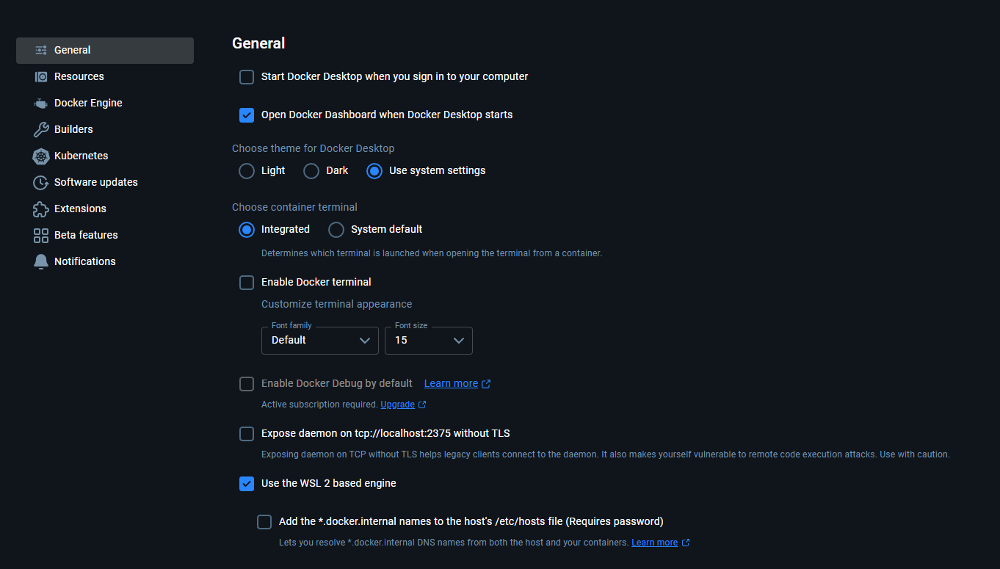

<h1 align="center">
     
    ClipFusion
</h1>
<p align="center"><it>
Alternative to Adobe Premiere Pro right in your browser.
<br/>
Fully open-source and free.
</it></p>

> [!CAUTION]
> ClipFusion is in active development and may be unstable!

## Getting Started

Currently, Docker is the only way to correctly start ClipFusion.
Starting ClipFusion outside of Docker is untested and may not work as expected.

First, ensure you have following software installed:
* [Docker](https://www.docker.com/get-started/)
* [Docker Compose](https://docs.docker.com/compose/install/)

1. **Clone the ClipFusion repository**
```
git clone https://github.com/ClipFusion-editor/clipfusion.git
cd clipfusion
```
2. **Start ClipFusion using Docker Compose in production mode**
```
docker-compose up web -d
```
ClipFusion will appear at [http://localhost:3000](http://localhost:3000)

---

**OR**, if you for whatever reason need to start ClipFusion in development mode, use:
```
docker-compose up web-development -d
```

ClipFusion will appear at [http://localhost:3001](http://localhost:3001)

> [!TIP]
> If you're using Docker + WSL2 on Windows you may encounter broken [Fast Refresh](https://nextjs.org/docs/architecture/fast-refresh) in development builds
> This is due to a bug in WSL2 that prevents file watcher from working as usual
> Currently there are two possible ways to combat this:
> 1. Use Hyper-V based engine instead of WSL2 based engine (uncheck `Use the WSL 2 based engine`)
>
> 
> 
> 2. If you really need to use WSL2 based engine, you need to set environment variable `USE_WEBPACK` to `true` before starting ClipFusion in development mode
> This option will force ClipFusion to use `webpack` instead of `turbopack` (Fast Refresh performance may suffer)

Installing any additional software besides Docker is not required.

## Screenshots

To be added.